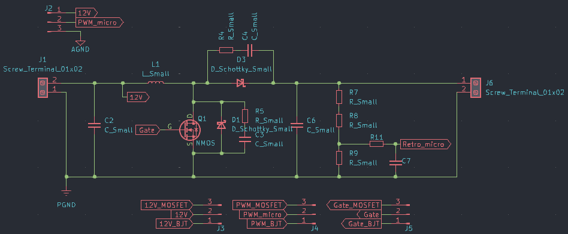
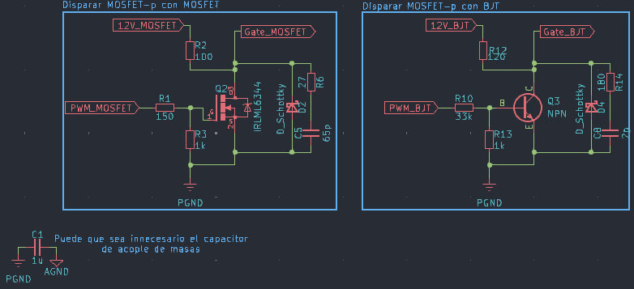

# Diseño de Convertidor Boost

### Requisitos

| Entrada           | Salida            |
|-                  |-                  |
|$V_{in}$ = 12 V    |$V_{out}$ = 24 V   |
|$I_{in}$ = 1 A     |$I_{out}$ = 0,5 A  |

El diseño del convertidor fue realizado siguiendo el siguiente documento, [Texas Instruments](https://www.ti.com/lit/an/slva372d/slva372d.pdf?ts=1743949048852)

**Criterios de diseño del circuito**

* $R_{load} = \frac{24 V}{0,5 A} = 48 \Omega$
* Ripple,
  * $\Delta I_L = I_{in} * 30 \% = 1 \ A * 0,3 = 0,3 \ A$
  * $\Delta V_{out} = V_{out} * 5 \% = 1,2 \ V$
* Frecuencia de conmutación, 15 kHz.

## Cálculo del Duty Cycle máximo

$$D = 1 - \frac{V_{in} * \eta }{V_{out}} = 1 - \frac{12 * 0,8 }{24} = 0,6$$

## Cálculo de Inductor

$$L = \frac{V_{in} * (V_{out} - V_{in})}{\Delta I_L * f_s * V_{out}} = \frac{12V * (24V - 12V)}{0,3A * 15 \times 10^3 Hz * 24V} = 1,33 mH$$

Tal vez sea conveniente la elección de un inductor arbitrario y luego calcular el ripple producto del mismo. Se deja como inquietud para las pruebas prácticas. Este valor se verá afectado en función de la fuente que se utilice para alimentación, 1 A tal vez es poca corriente.

## Selección de Capacitor de entrada

Utilizado para filtrar la tensión de entrada, si la fuente es demasiado ruidosa, el capacitor se puede incrementar para mejorar el filtrado. 

Valor elegido, $1 \ \mu F$. Requerirá ajustes en la práctica.

## Cálculo de Capacitor de salida

$$C_{out} = \frac{I_{out} * D}{f_s * \Delta V_{out}} = \frac{0,5 A * 0,6}{15 \times 10^3 Hz * 1,2 V} = 16,67 \ \mu F$$

## Cálculo de corriente por el diodo

$$I_D = I_{out_{max}}$$

Se recomienda el uso de diodos Schottky.

## Red de realimentación

$$V_{out} = \frac{V_{in}*R_2}{R_1+R_2}$$

$$3,3 V= \frac{24 V * 4,7 k\Omega}{R_1 + 4,7 k\Omega}$$

$$R_1 = 29,48 k\Omega \approx 27 k\Omega + 2,2 k\Omega$$

## Diseño Prototipo Boost 12 V a 24 V

