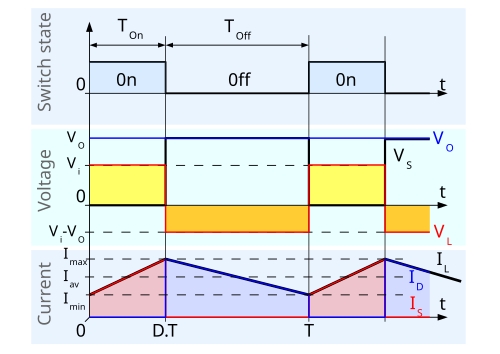
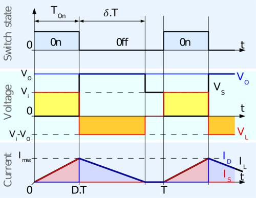

# Convertidor Boost

### Lista de Entradas-Salidas

<!-- 
| Señal | Tipo |
|----|-----|
| Tensión de alimentación | Entrada |
| Señal de control gate | Entrada |
| Tensión de salida | Salida |
| Tensión de retroalimentación | Salida |
-->

| Entrada | Salida |
|----|-----|
| Tensión de alimentación, $V_{cc}$ = 12 V | Tensión de salida, $V_{out}$ = 24 V|
| Señal de control gate, PWM -- 0 a 3,3 V | Tensión de retroalimentación, $V_\beta$ entre 0 y 3,3 V  |

El desarrollo siguiente fue obtenido de, [Electrical Technology](https://www.electricaltechnology.org/2020/09/buck-converter.html), 

## Resumen
Un convertidor boost, también conocido como elevador de voltaje, es un tipo de convertidor DC-DC que incrementa la tensión de entrada a un nivel superior en la salida. Funciona almacenando energía en un inductor durante el tiempo en que un interruptor (generalmente un transistor) está cerrado, y transfiriéndola a través de un diodo hacia la carga cuando el interruptor se abre. 

Este aumento de tensión en la salida se consigue a expensas de una menor corriente de salida. Aunque esto depende del diseño específico, es común que la corriente disminuya al elevar el voltaje, de manera de conservar la potencia según el principio de conservación de la energía.
<!--
FALTA HACER RESUMEN
-->

## Funcionamiento

### Componentes principales del convertidor

* Interruptor, puede ser un transistor BJT como un MOSFET.
* Diodo de rectificación.
* Inductor.
* Capacitor de salida.
* Controlador PWM.

### Modo Encendido

Durante esta etapa, el voltaje de entrada es aplicado al inductor, generando que acumule energía. El diodo se encuentra polarizado inversamente debido a que el nodo que se encuentra entre el inductor, interruptor y el diodo, se encuentra a un potencial prácticamente de 0, por ello la corriente se deriva por el interruptor y no por el diodo, además hay que considerar que en esta etapa, el capacitor de salida se encuentra suministrando energía a la carga, por ende el cátodo del diodo se encuentra a un potencial mayor que el ánodo del mismo, por eso se dice que está polarizado de forma inversa.

### Modo Apagado

Cuando el interruptor se abre, toda la energía almacenada en el inductor es aplicada en el diodo haciendo que el mismo se polarice directamente, produciendo que el inductor disminuya la energía almacenada en el mismo. 

### Medición de tensión

La medición de tensión se realiza de la misma forma que en el caso del convertidor Buck, en caso de ser necesario una mayor explicación retomar el documento, FUNCIONAMIENTO DEL BUCK

Si el interruptor tiene un período de conmutación lo suficientemente rápido, el inductor no llega a descargase en su totalidad entre los períodos, haciendo que en la carga se aplique un voltaje mayor al voltaje de entrada. También, mientras el interruptor está abierto, el capacitor de salida se carga con este voltaje combinado. Cuando el interruptor se cierra, el capacitor de salida es el encargado de suministrar energía a la carga. Por ello el interruptor debe ser rápidamente conmutado a abierto para evitar la descarga completa del capacitor de salida.

$V_{out} = \frac{V_{in}}{1-D}$

La ecuación anterior muestra el voltaje en régimen permanente, y como al aumentar el duty, la tensión de salida se ve aumentada.

### Modo continuo y descontinuo de conducción

**Modo Continuo de conducción**

**Modo Discontinuo de conducción**

Para cargas ligeras, el convertidor trabaja en modo Discontinuo.