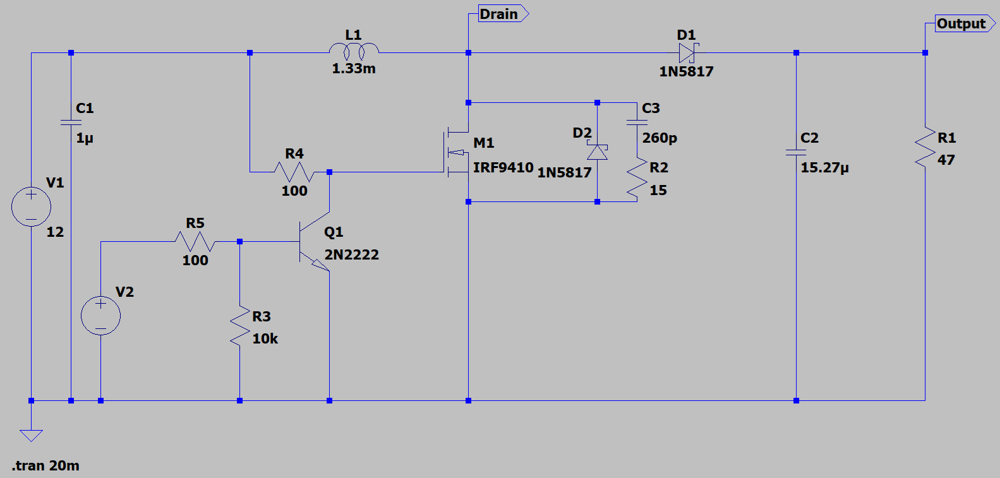
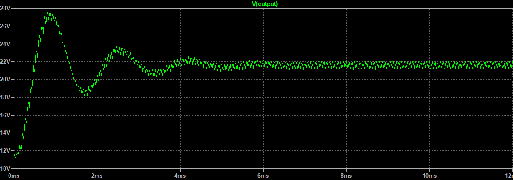
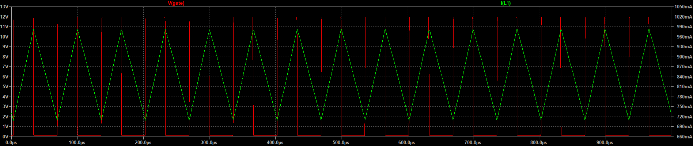
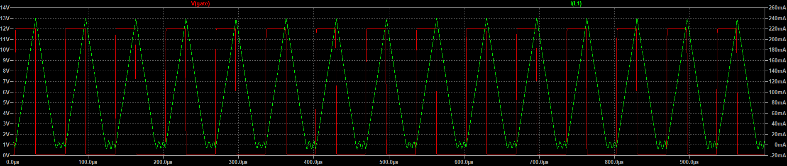

# Resultados de Simulación

## Circuito Convertidor Boost

### Tensión de Salida del convertidor

La tensión de salida de convertidor presenta una respuesta subamortiguada por la naturaleza de un sistema
de segundo orden. Para mejorar la respuesta del convertidor es necesario un sistema de control sencillo, como
puede ser un PI.

### Modo CCM

La corriente en el inductor nunca llega a ser '0' por ello se lo denomina modo continuo de conducción. 
Suele ser necesario cuando la carga requiere más corriente.

Pruebas con carga de 47 $\Omega$ y un duty de 44 %

### Modo DCM

En este caso, a diferencia del CCM, la corriente en el inductor es '0' antes de que el transistor de conmutación se encienda nuevamente. Este modo se lo conoce como modo discontinuo de conducción. Se aplica
cuando la carga no tiene un consumo excesivo.

Pruebas con carga de 400 $\Omega$ y un duty de 39 %

