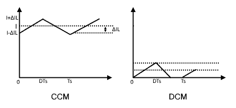
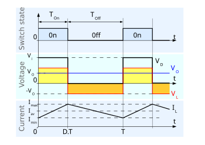
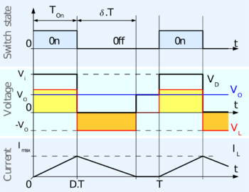
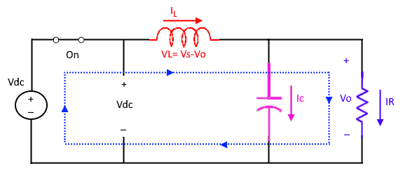
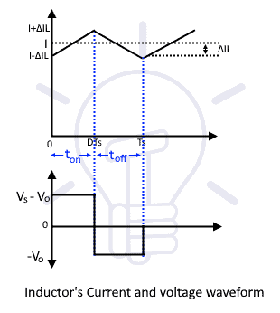
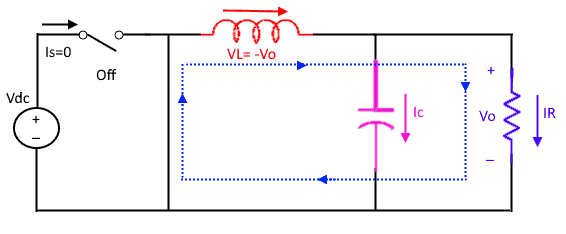
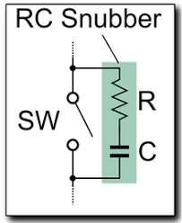
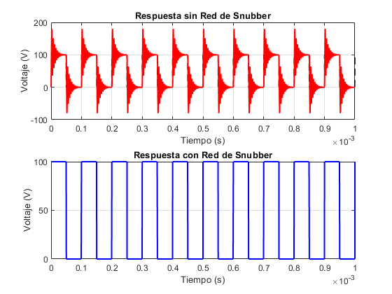

# Convertidor Buck

### Lista de Entradas-Salidas

| Señal | Tipo |
|----|-----|
| Tensión de alimentación | Entrada |
| Señal de control gate | Entrada |
| Tensión de salida | Salida |
| Tensión de retroalimentación | Salida |

El desarrollo siguiente fue obtenido de, [Electrical Technology](https://www.electricaltechnology.org/2020/09/buck-converter.html), 

## Resumen

Un convertidor Buck básico consiste en una conmutación controlada de un interruptor, un diodo, un filtro de salida, y un circuito de realimentación. El interruptor es el encargado de traspasar la potencia de entrada a la salida, dependiendo de la velocidad de conmutación o del tiempo que esté encendido, la tensión en la salida puede ser aumentar o disminuir, manteniéndose siempre por debajo de la tensión de entrada.

El voltaje medio de salida del convertidor puede ser controlado de 2 formas, PWM (pulse width modulation) o PFM (pulse frequency modulation). En el primero de los casos lo que se modifica es el tiempo de encendido, manteniéndose el periodo constante. A diferencia de PFM donde el periodo es el que se modifica (cambia la frecuencia de conmutación), pero el tiempo de encendido se mantiene constante, por ejemplo en un 50 % del duty. El método más elegido para los convertidores buck es el PWM.

Otro punto importante de los convertidores es el modo de operación, el mismo puede operar en dos modos de conducción, CCM (continuous conduction mode) y DCM (discontinuous conduction mode); en el primero la corriente en el inductor de salida permanece en un valor positivo, haciendo que nunca tenga corriente cero a través del mismo en el periodo de conmutación. En cambio para el caso de DCM, la corriente en el inductor se hace cero en algunos momentos del periodo de conmutación.

Si un convertidor fue diseñado para trabajar en modo CCM, también lo hará en modo DCM cuando al corriente por la carga disminuye.

Las imágenes siguientes fueron obtenidas de [Wikipedia](https://es.wikipedia.org/wiki/Convertidor_reductor#:~:text=El%20convertidor%20reductor%E2%80%8B%E2%80%8B,menor%20que%20a%20su%20entrada.).

## Funcionamiento

### Componentes principales del convertidor

* Interruptor, puede ser un transistor BJT como un MOSFET.
* Diodo de rectificación.
* Inductor.
* Capacitor de salida.
* Controlador PWM.

### Modo Encendido

En este momento el diodo queda polarizado de forma inversa, haciendo que toda la corriente de entrada se aplique en el inductor; el inductor se carga.

En la figura anterior se observa que, mientras el interruptor (en la mayoría de casos un transistor) conduce, la corriente a través del inductor aumenta llegando a su valor máximo; en el momento en que se apaga el interruptor la corriente comienza a disminuir.

### Modo Apagado

En este momento, el interruptor se encuentra abierto, y el inductor cambia su polaridad para oponerse a la descarga que está sufriendo el mismo, y el diodo queda polarizado en forma directa. 

### Medición de tensión

La medición de tensión es realizada mediante un divisor resistivo que reduce la tensión a un valor seguro para trabajarlo en el microcontrolador. Además se le anexa un filtro RC a la entrada del ADC para mejorar la medición del mismo. 

El objetivo de esta medición es poder realizar un control preciso de la tensión y corriente entregada a la carga, por ello se aplica un lazo cerrado donde la tensión de salida se la compara con una tensión de referencia (set-point), para así aplicar la corrección del ciclo de trabajo del PWM para lograr la conmutación correcta del transistor.

Si la carga demanda menos corriente, la tensión tiende a subir y viceversa, por ello la utilidad de un control para ajustar el D en función de la carga conectada al convertidor.

Hay diversas técnicas de control, dentro de las más utilizadas, PID.

## Red de Snubber

Esta red es la encargada de reducir los picos de voltaje y de proteger al interruptor, frente a la rápida conmutación que realiza el mismo. Cuando el transistor conmuta en un periodo muy pequeño (alta frecuencia), se generan picos en $t_{on}$ y $t_{off}$ que son indeseados y empeoran el rendimiento del convertidor, por ello, se utiliza una red de Snubber, filtro RC que se encarga de filtrar esos altos picos de tensión debidos a la conmutación del interruptor.

