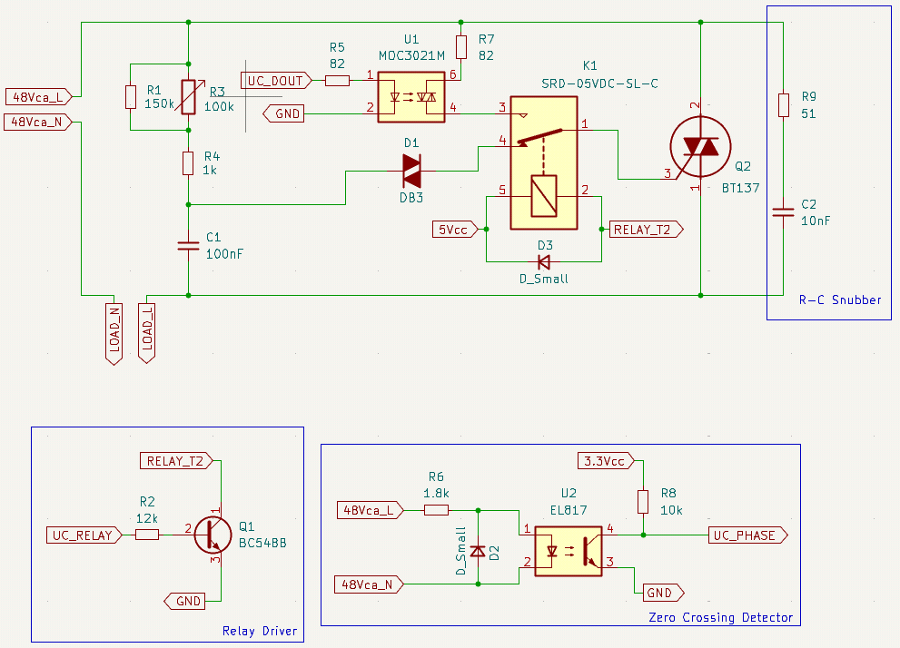

# Diseño dimmer control analógico o digital

## Entradas y salidas
| Entrada                       | Salida                                |
|-------                        |-------                                |
|$V_{ca}$ = 48 Vca              | $UC_{phase}$ = Onda cuadrada 3.3 Vcc  |
|$5V_{cc}$ = 5 Vcc              | $Load$ = Onda recortada 0-48 Vca RMS  |
|$3.3V_{cc}$ = 3.3 Vcc          |                                       |
|$UC_{Dout}$ = Pulso 3.3 Vcc    |                                       |
|$UC_{Relay}$ = 0 V o 3.3 Vcc   |                                       |

## Circuito control analógico R-C

### Criterios de diseño
* $ C1 = 100\ nF $
* $ \hat{V}_{DIAC} = 32\ V $ ([Datasheet DB3](../../../Datasheets/DB3.pdf))
* $ f = 50\ Hz $

### Desarrollo de fórmulas

1. $$ V_{DIAC} = I_{RMS} \cdot X_C $$
2. $$ I_{RMS} = \dfrac{V_{ca}}{|Z|} = \dfrac{V_{ca}}{\sqrt{R^2+{X_C}^2}} $$

*Reemplazando 2 en 1:*

3. $$ V_{DIAC} = \dfrac{V_{ca}}{\sqrt{R^2+{X_C}^2}} \cdot X_C $$
4. $$ \hat{V}_{DIAC} = \dfrac{V_{DIAC}}{\sqrt{2}} $$

*Reemplazando 4 en 3:*

5. $$ \hat{V}_{DIAC} = \dfrac{\sqrt{2} \cdot V_{ca} \cdot X_C }{\sqrt{R^2+{X_C}^2}} $$

*Pasando denominador y elevando ambos lados al cuadrado:*

6. $$ { \left( \hat{V}_{DIAC} \cdot \sqrt{R^2+{X_C}^2} \right) }^2 = {\left( \sqrt{2} \cdot V_{ca} \cdot X_C \right)} ^2 $$

7. $$ {\hat{V}_{DIAC}}^2 \cdot \left( R^2 + {X_C}^2  \right) = 2 \cdot {V_{ca}}^2 \cdot {X_C}^2 $$

8. $$ R^2 + {X_C}^2 = \dfrac{2 \cdot {V_{ca}}^2 \cdot {X_C}^2}{{\hat{V}_{DIAC}}^2} $$

9. $$ R^2 = \dfrac{2 \cdot {V_{ca}}^2 \cdot {X_C}^2}{{\hat{V}_{DIAC}}^2} - {X_C}^2 $$

10. $$ R^2 = {X_C}^2 \cdot \left( \dfrac{2 \cdot {V_{ca}}^2}{{\hat{V}_{DIAC}}^2} - 1 \right) $$

11. $$ R = \sqrt{{X_C}^2 \cdot \left( \dfrac{2 \cdot {V_{ca}}^2}{{\hat{V}_{DIAC}}^2} - 1 \right) } $$

*Distribuyendo raíz cuadrada:*

12. $$ R = X_C \cdot \sqrt{\dfrac{2 \cdot {V_{ca}}^2}{{\hat{V}_{DIAC}}^2} - 1 } $$

13. $$ X_C = \dfrac{1}{2 \pi \cdot f \cdot C}$$

*Reemplazando 13 en 12:*

14. $$ R = \dfrac{1}{2 \pi \cdot f \cdot C} \cdot \sqrt{\dfrac{2 \cdot {V_{ca}}^2}{{\hat{V}_{DIAC}}^2} - 1 } $$

*Reemplazando valores para obtener el valor de la resistencia:*

15. $$ R = \dfrac{1}{2 \pi \cdot 50\ Hz \cdot 100\ nF} \cdot \sqrt{\dfrac{2 \cdot {(48\ V)}^2}{{(32\ V)}^2} - 1 } = 59,55\ k\Omega$$

Se establece una **resistencia mínima** $R4 = 1 k\Omega$ y se decide utilizar un **potenciómetro** $R3 = 100\ k\Omega $

16. $$ R1 // R3 = R - R4 $$

17. $$ {\left( {(R1)}^{-1} + {(R3)}^{-1} \right)}^{-1} = R - R4 $$

18. $$ {\left( {(R1)}^{-1} + {(100\ k\Omega)}^{-1} \right)}^{-1} = 59,55\ k\Omega - 1\ k\Omega $$

19. $$ R1 = 141,2\ k\Omega \approx 150\ k\Omega$$

## Circuito red Snubber R-C

### Criterios de diseño

* $ dI/dt < 50\  A/\mu s $ ([Datasheet BT137](../../../Datasheets/BT137.pdf))

### Desarrollo de fórmulas

Según [STMicroelectronics](https://www.st.com/resource/en/application_note/an437-rc-snubber-circuit-design-for-triacs-stmicroelectronics.pdf) para los TRIACs con  $ dI/dt $ máxima de $ 50\  A/\mu s $, se necesita como mínimo una resistencia de $47\ \Omega$. Se selecciona un **capacitor** $C2 = 10\ nF$ al igual que en la guía, ya que en la práctica la selección del mismo depende mucho de la carga *(sujeto a cambio)*.

*Usando resistencias con tolerancias $\pm 5 \%$ (banda dorada en THT):*

20. $$ 51\ \Omega * 0.95 = 48,45\ \Omega > 47\ \Omega $$

*Usando resistencias con tolerancias $\pm 10 \%$ (banda plateada en THT):*

21. $$ 56\ \Omega * 0.90 = 50,4\ \Omega > 47\ \Omega $$

Por lo tanto, se opta por utilizar una $R9 = 51\ \Omega$ si es una resistencia con tolerancia $\pm 5\%$ o una $R9 = 56\ \Omega$ si es una con tolerancia $\pm 10\%$

## Circuito OptoTRIAC

### Criterios de diseño - Emisor

* $ I_{F(max)} = 60\ mA $ ([Datasheet BT137](../../../Datasheets/BT137.pdf))

