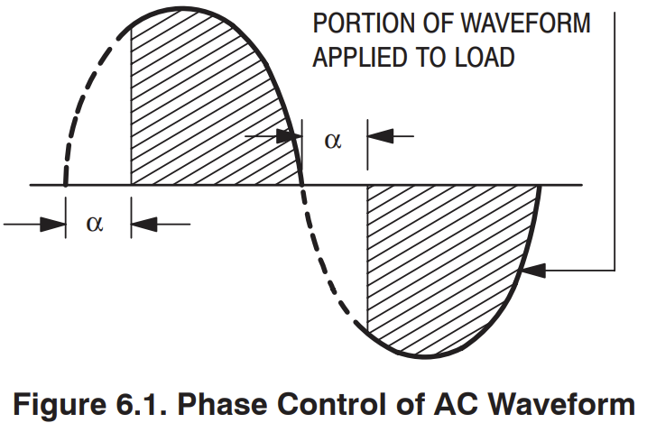
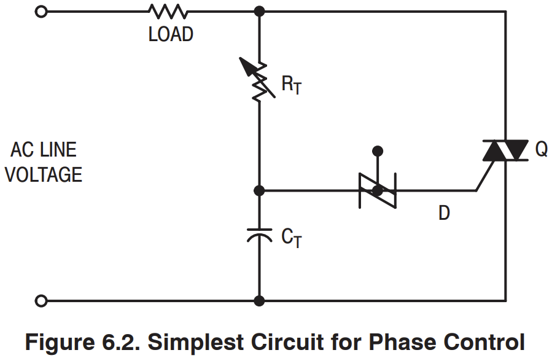
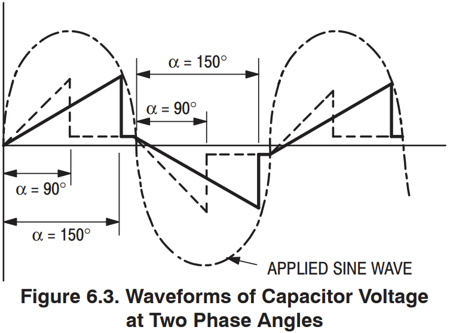
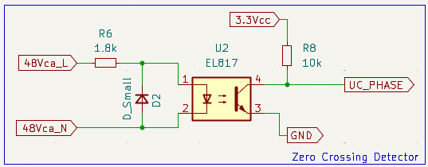
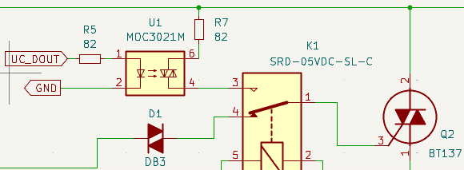
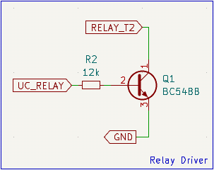
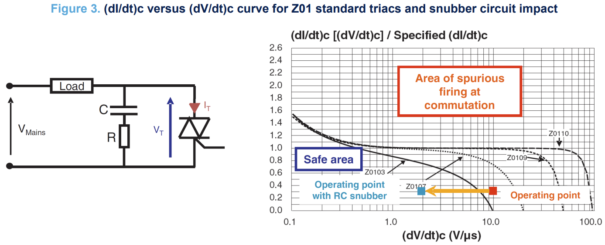

# Recortador de onda "Dimmer"

## Entradas y salidas
| Entrada                       | Salida                                |
|-------                        |-------                                |
|$V_{ca}$ = 48 Vca              | $UC_{phase}$ = Onda cuadrada 3.3 Vcc  |
|$5V_{cc}$ = 5 Vcc              | $Load$ = Onda recortada 0-48 Vca RMS  |
|$3.3V_{cc}$ = 3.3 Vcc          |                                       |
|$UC_{Dout}$ = Pulso 3.3 Vcc    |                                       |
|$UC_{Relay}$ = 0 V o 3.3 Vcc   |                                       |

## Resumen

El recortador de onda "Dimmer" tiene como objetivo regular la potencia
entregada a la carga, mediante el uso de un tiristor, recortando la onda
de tensión aplicada a la carga. En esta placa, se utilizan dos métodos
distintos de control: analógico y digital.

El control analógico permite cambiar el ángulo de disparo del tiristor TRIAC. Con un simple circuito R-C, se varía la resistencia y, por lo tanto, la constante de tiempo de carga del capacitor para retardar el disparo del DIAC, encargado de disparar el TRIAC. Debido al comportamiento del TRIAC, una vez "disparado", no deja de conducir hasta el cruce por cero de la tensión aplicada entre ambos ánodos.

El control digital se compone de dos circuitos distintos: el Zero Crossing Detector (detector de cruce por cero) y el driver de TRIAC. El primero permite al microcontrolador sincronizarse con la tensión de corriente alterna y el segundo permite al microcontrolador "disparar" el TRIAC cuando se quiera.

Con un circuito driver de Relé, se permite cambiar entre ambos modos, siendo el control analógico el activado por defecto (contacto normal-cerrado).

## Control de fase con tiristores

El método más común de control electrónico de potencia de CA se denomina control de fase. La Figura 6.1 ilustra este concepto. Durante la primera parte de cada semiciclo de la onda sinusoidal de CA, se abre un interruptor electrónico para impedir el flujo de corriente. En un ángulo de fase específico, α, este interruptor se cierra para permitir que se aplique toda la tensión de línea a la carga durante el resto de ese semiciclo. La variación de α controlará la parte de la onda sinusoidal total que se aplica a la carga (área sombreada) y, por lo tanto, regulará el flujo de potencia hacia la carga.

El circuito más simple para lograr el control de fase se muestra en la Figura 6.2. En este caso, el interruptor electrónico es un TRIAC (Q) que se activa mediante un pequeño pulso de corriente en su compuerta. El TRIAC se desactiva automáticamente cuando la corriente que lo atraviesa pasa por cero. En el circuito mostrado, el capacitor CT se carga durante cada semiciclo mediante la corriente que fluye a través de la resistencia RT y la carga. El hecho de que la carga esté en serie con RT durante esta parte del ciclo tiene poca importancia, ya que la resistencia de RT es mucho mayor que la de la carga. Cuando la tensión en el CT alcanza la tensión de ruptura del disparador bilateral DIAC (D), se libera la energía almacenada en el capacitor CT. Esta energía produce un pulso de corriente en el DIAC, que fluye a través de la compuerta del TRIAC y lo activa. Dado que tanto el DIAC como el TRIAC son dispositivos bidireccionales, los valores de RT y CT determinarán el ángulo de fase en el que se activará el TRIAC en los semiciclos positivo y negativo de la onda sinusoidal de CA.

La forma de onda del voltaje a través del capacitor para dos condiciones de control típicas (α = 90° y 150°) se muestra en la Figura 6.3. Si se utiliza un rectificador controlado por silicio en este circuito en lugar del TRIAC, solo se controlará un semiciclo de la forma de onda. El otro semiciclo se bloqueará, lo que genera una salida de CC pulsante cuyo valor promedio puede variarse ajustando el RT. 
(Referencia: [Thyristor Theory and Design Considerations: Handbook](https://www.rsp-italy.it/Electronics/Databooks/ON/_contents/ON%20Thyristor%20theory%20and%20design%20handbook%20HBD855D%202005.pdf))

Este tipo de control de fase se recomienda solamente para circuitos con carga resistiva o levemente inductiva (ver [AN308 (STMicroelectronics)](https://www.st.com/resource/en/application_note/an308-triac-analog-control-circuits-for-inductive-loads-stmicroelectronics.pdf))

## Circuito detector de cruce por cero (ZCD)

Este simple circuito convierte la señal de entrada de CA sinusoidal en una señal aislada cuadrada, que permite al microcontrolador conocer el momento de cruce por cero (cuando la onda cuadrada pasa de 3,3 V a 0 V o 0 V a 3,3 V).

En el semiciclo positivo de la tensión de CA, se enciende el led interno del optoacoplador, lo que polariza el transistor de salida, que lleva la tensión UC_PHASE a 0 V. En el semiciclo negativo, la corriente fluye por el diodo D2, manteniendo la tensión reversa del led interno fija y menor a la máxima permitida (6 V para el EL817).

## Driver de TRIAC

Con este circuito se permite disparar el TRIAC en cualquier momento de forma aislada, solamente enviando un pulso con el microcontrolador a UC_DOUT. No es necesario mantener la señal por más que unos pocos microsegundos, ya que una vez disparado el TRIAC, no deja de conducir hasta que la tensión aplicada entre ambos ánodos cruza por cero.

## Driver de relé

Simple circuito que permite conmutar el relé, para así cambiar entre ambos modos de control (analógico y digital). Cuando UC_RELAY es de 0 V, el circuito utilizado es el de control analógico, mientras que cuando UC_RELAY es de 3,3 V, se activa el control digital.

## Red Snubber

Como se observa en la figura 3, un alto dv/dt puede causar un falso disparo del TRIAC, afectando negativamente al circuito control de fase. (Más info, ver [AN437 STMicroelectronics](https://www.st.com/resource/en/application_note/an437-rc-snubber-circuit-design-for-triacs-stmicroelectronics.pdf))