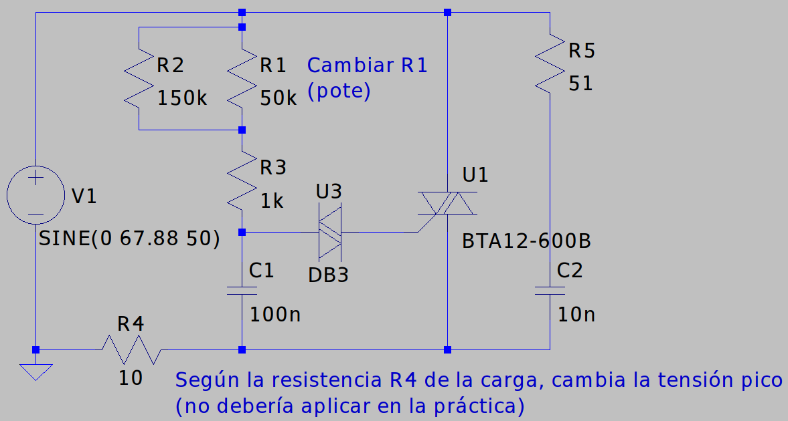
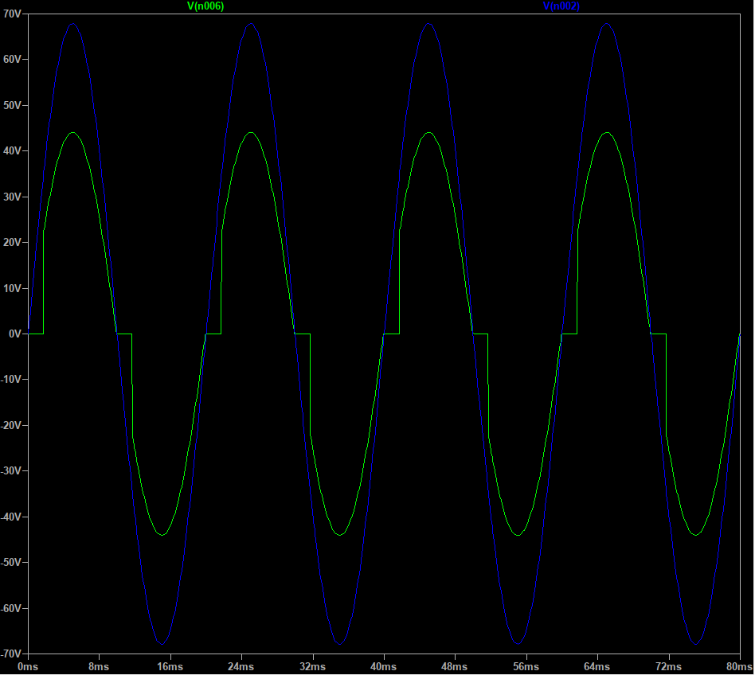
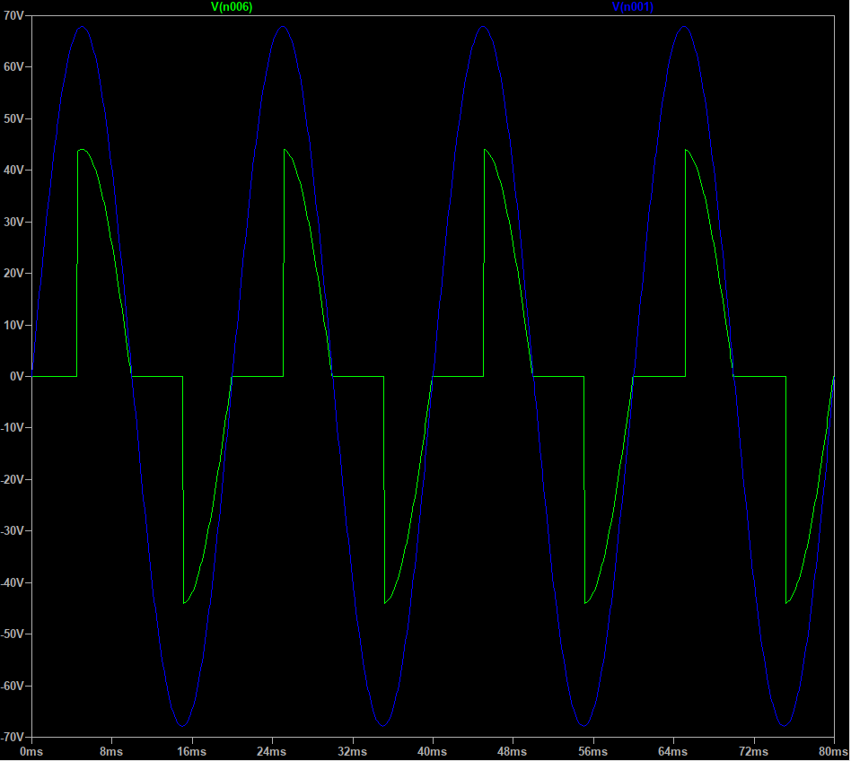
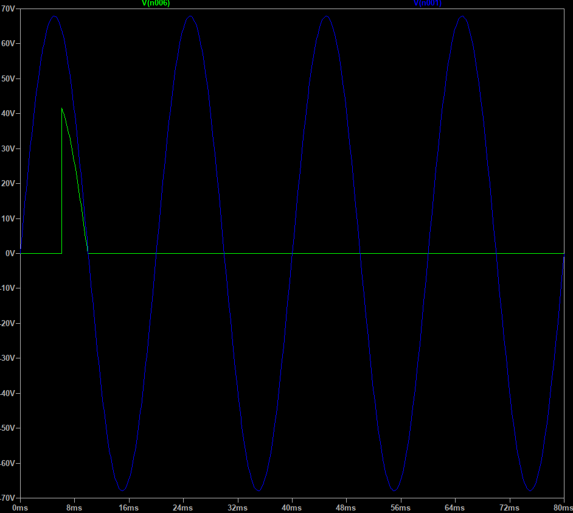

# Resultados simulación

## Circuito

## Formas de onda
- 🔵 Tensión de entrada
- 🟢 Tensión en la carga

(La amplitud varía según el valor de la resistencia de la carga, en la práctica no debería afectar)

### Potenciómetro en 0

### Potenciómetro en 50k (50%)

### Potenciómetro en 100k (100%)

