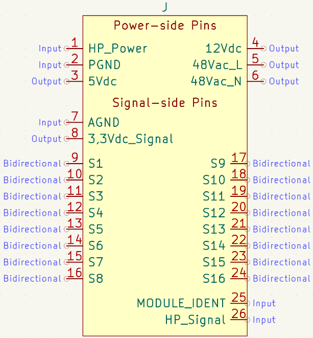
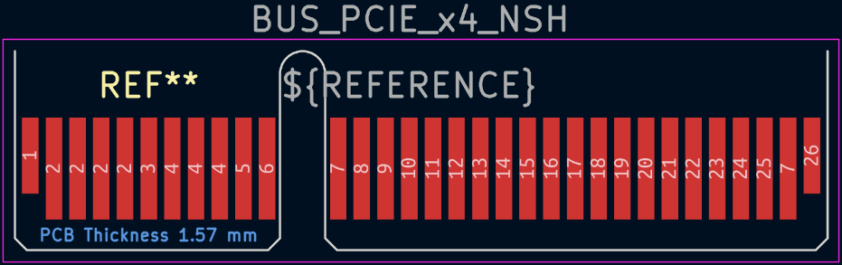

# Tabla de Pines ESP32-S3 para el conector PCIe x4

| Símbolo PCIe x4 | Pad Footprint PCIe x4 | GPIO ESP32-S3 |
|:---------------:|:---------------------:|:-------------:|
|     HP_Power    |           1           |       35      |
|       AGND      |           7           |      GND      |
|  3,3Vdc_Signal  |           8           |      3V3      |
|        S1       |           9           |   4 (ADC1_3)  |
|        S2       |           10          |   5 (ADC1_4)  |
|        S3       |           11          |   6 (ADC1_5)  |
|        S4       |           12          |   7 (ADC1_6)  |
|        S5       |           13          |  15 (ADC2_4)  |
|        S6       |           14          |  16 (ADC2_5)  |
|        S7       |           15          |  17 (ADC2_6)  |
|        S8       |           16          |  18 (ADC2_7)  |
|        S9       |           17          |   8 (ADC1_7)  |
|       S10       |           18          |       36      |
|       S11       |           19          |       37      |
|       S12       |           20          |       38      |
|       S13       |           21          |       39      |
|       S14       |           22          |       40      |
|       S15       |           23          |       41      |
|       S16       |           24          |   2 (ADC1_1)  |
|   MODULE_IDENT  |           25          |   3 (ADC1_0)  |
|    HP_Signal    |           26          |       42      |

# Imágenes de referencia

